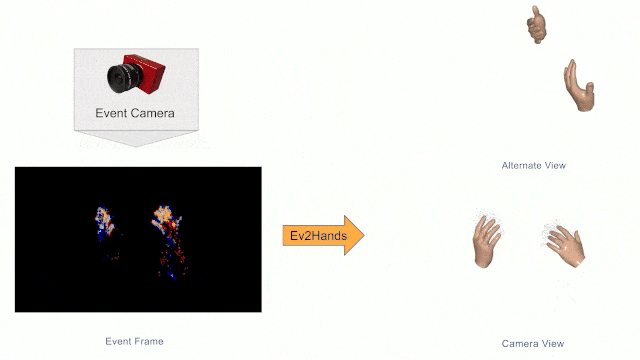
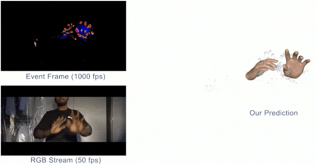
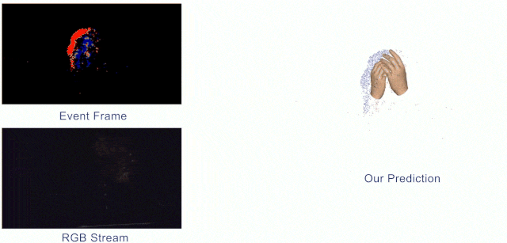
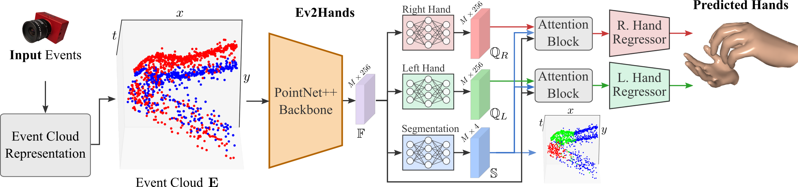
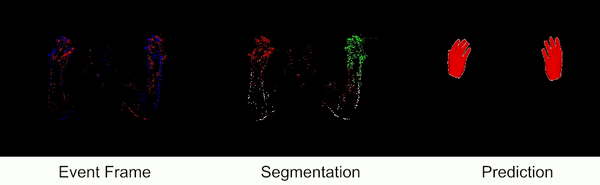

# Ev2Hands: 3D Pose Estimation of Two Interacting Hands from a Monocular Event Camera [3DV'24]
### Official PyTorch implementation

[Project page](https://4dqv.mpi-inf.mpg.de/Ev2Hands/) | [Paper](https://arxiv.org/abs/2312.14157) | [🤗 Demo](https://huggingface.co/spaces/chris10/ev2hands)

<p align="center">
</br>
</p>

## Abstract

3D hand tracking from a monocular video is a very challenging problem due to hand interactions, occlusions, left-right hand ambiguity, and fast motion. Most existing methods rely on RGB inputs, which have severe limitations under low-light conditions and suffer from motion blur. In contrast, event cameras capture local brightness changes instead of full image frames and do not suffer from the described effects, but, unfortunately, existing image-based techniques cannot be directly applied to events due to significant differences in the data modalities. In response to these challenges, this paper introduces **the first framework for 3D tracking of two fast-moving and interacting hands from a single monocular event camera**. Our approach tackles the left-right hand ambiguity with a novel semi-supervised feature-wise attention mechanism and integrates an intersection loss to fix hand collisions. To facilitate advances in this research domain, we release a new synthetic large-scale dataset of two interacting hands, Ev2Hands-S, and a new real benchmark with real event streams and ground-truth 3D annotations, Ev2Hands-R. Our approach outperforms existing methods in terms of the 3D reconstruction accuracy and generalizes to real data under severe light conditions.


### Advantages of Event Based Vision
High Speed Motion                      |  Low Light Performance          
:-------------------------:|:-------------------------:|
       |    

### Ev2Hands

<p align="center">
</br>
</p>

## Usage
-----
  * [Installation](#installation)
  * [Datasets](#datasets)
    + [Ev2Hands-S](#ev2hands-s)
    + [Ev2Hands-R](#ev2hands-r)
  * [Training](#training)
    + [Pretraining on Ev2Hands-S](#pretraining)
    + [Finetuning on Ev2Hands-R](#finetuning)
  * [Evaluation](#evaluation)
    + [Evaluation on Ev2Hands-S](#ev2hands-s-1)
    + [Evaluation on Ev2Hands-R](#evaluation)
  * [Demo](#demo)
  * [Citation](#citation)
  * [License](#license)
------

### Installation

Clone the repository
```
https://github.com/Chris10M/Ev2Hands.git
cd Ev2Hands
```

#### Data Prerequisites

##### Data Folder

* Please register at the [MANO](https://mano.is.tue.mpg.de/) website and download the MANO models.
* Put the MANO models in a folder with the following structure.
* Download the data from [here](https://gvv-assets.mpi-inf.mpg.de/twoeventhands/data.zip) and ensure that the files and folders have the following structure.   
```bash
src
|
└── data
      |
      └── models
      |     |
      |     └── mano
      |           ├── MANO_RIGHT.pkl
      |           └── MANO_LEFT.pkl
      └── background_images
      └── mano_textures
      └── J_regressor_mano_ih26m.npy
      └── TextureBasis
```

##### Pretrained Model 

The pretrained model ```best_model_state_dict.pth``` can be found [here](https://gvv-assets.mpi-inf.mpg.de/twoeventhands/best_model_state_dict.pth). Please place the model in the following folder structure.

```bash
src
|
└── Ev2Hands
       |
       └── savedmodels
               |
               └── best_model_state_dict.pth
```


#### Hand Simulator
Create a conda enviroment from the file 
```
conda env create -f hand_simulator.yml
```
Install **[VID2E](https://github.com/uzh-rpg/rpg_vid2e)** inside ```src/HandSimulator``` following the instructions from [here](https://github.com/uzh-rpg/rpg_vid2e). This is needed for generating events from the synthetic data. 

#### Ev2Hands
Create a conda enviroment from the file 
```
conda env create -f ev2hands.yml
```

Install **[torch-mesh-isect](https://github.com/vchoutas/torch-mesh-isect)** following the instructions from [here](https://github.com/vchoutas/torch-mesh-isect). This is needed for the Intersection Aware Loss. 

Note: To compile [torch-mesh-isect](https://github.com/vchoutas/torch-mesh-isect), we found pytorch=1.4.0 with cuda10.1 works without any issues.
```
conda install pytorch==1.4.0 torchvision==0.5.0 cudatoolkit=10.1 -c pytorch
```

### Datasets

#### Ev2Hands-S

##### Download 

The Ev2Hands-S can be downloaded from [here](https://gvv-assets.mpi-inf.mpg.de/twoeventhands/Ev2Hands-S.tar). Unzip and set ````ROOT_TRAIN_DATA_PATH```` in ```src/settings.py``` to the path of the downloaded dataset.

##### Generation 
* Download [InterHand2.6M](https://mks0601.github.io/InterHand2.6M/) (5 fps), and set ```INTERHAND_ROOT_PATH``` in ```src/settings.py``` to the  directory of InterHand2.6M_5fps_batch1 
* Set the path to generate Ev2Hands-S, ````ROOT_TRAIN_DATA_PATH```` in ```src/settings.py```. Now, run
  ```
  cd src/HandSimulator
  GENERATION_MODE={'train', 'val', 'test'} python main.py
  ```
  to generate the dataset in parts.
  Note: Set ```GENERATION_MODE``` as either train, val or test.

* After the dataset parts are generated, we stich the parts to get a H5 event dataset and an annnotation pickle using, 
  ```
  cd src/HandSimulator
  GENERATION_MODE={'train', 'val', 'test'} python stich_mp.py 
  ```
  Note: Set ```GENERATION_MODE``` as either train, val or test.

* For generating the dataset using SLURM, please check ```src/HandSimulator/slurm_main.sh, src/HandSimulator/slurm_stich_mp.sh```

#### Ev2Hands-R

##### Download 
The Ev2Hands-R can be downloaded from [here](https://gvv-assets.mpi-inf.mpg.de/twoeventhands/Ev2Hands-R.tar). Unzip and set the train and test folders of Ev2Hands-R in ```src/settings.py```
```
REAL_TRAIN_DATA_PATH = 'path/to/Ev2Hands-R/train'
REAL_TEST_DATA_PATH = 'path/to/Ev2Hands-R/test'
```


### Training

#### Pretraining
For pretraining, ensure [Ev2Hands-S](#ev2hands-s) is present. Please check ```src/Ev2Hands/arg_parser.py``` for default batch size and checkpoint path.
  ```
  cd src/Ev2Hands
  python train.py 
  ```

#### Finetuning
For finetuning, ensure [Ev2Hands-R](#ev2hands-r) is present. Please check ```src/Ev2Hands/arg_parser.py``` for default batch size and checkpoint path.
  ```
  cd src/Ev2Hands
  python finetune.py 
  ```

### Evaluation

#### Ev2Hands-S 
For evaluation, ensure [Ev2Hands-S](#ev2hands-s) is present. Note: The provided model will not work well with Ev2Hands-S as it is finetuned for Ev2Hands-R.

  ```
  cd src/Ev2Hands
  python evaluate.py 
  ```


#### Ev2Hands-R
For evaluation, ensure [Ev2Hands-R](#ev2hands-r) is present. 

  ```
  cd src/Ev2Hands
  python evaluate_ev2hands_r.py 
  ```


### Demo
Performs inference on real event streams. A trained model is needed for demo to work. You can also use the [pretrained model](#pretrained-model).

<figure>
  <p align="center">
    
  </p>
</figure>

To run the demo,
```
cd src/Ev2Hands
python3 demo.py
```
Please check ```src/Ev2Hands/arg_parser.py``` for default batch size and checkpoint path.
## Citation

If you find this code useful for your research, please cite our paper:
```
@inproceedings{Millerdurai_3DV2024, 
    title={3D Pose Estimation of Two Interacting Hands from a Monocular Event Camera}, 
    author={Christen Millerdurai and Diogo Luvizon and Viktor Rudnev and André Jonas and Jiayi Wang and Christian Theobalt and Vladislav Golyanik}, 
    booktitle = {International Conference on 3D Vision (3DV)}, 
    year={2024} 
} 
```

## License

Ev2Hands is under [CC-BY-NC 4.0](https://creativecommons.org/licenses/by-nc/4.0/) license. The license also applies to the pre-trained models.

